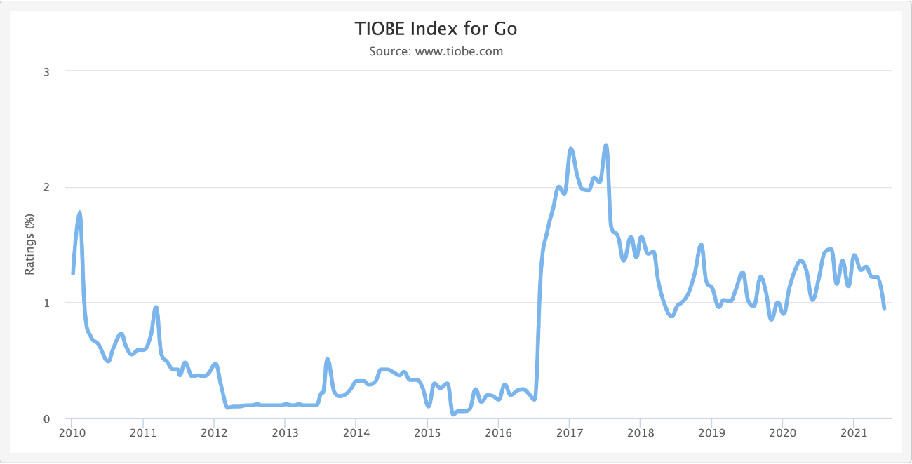
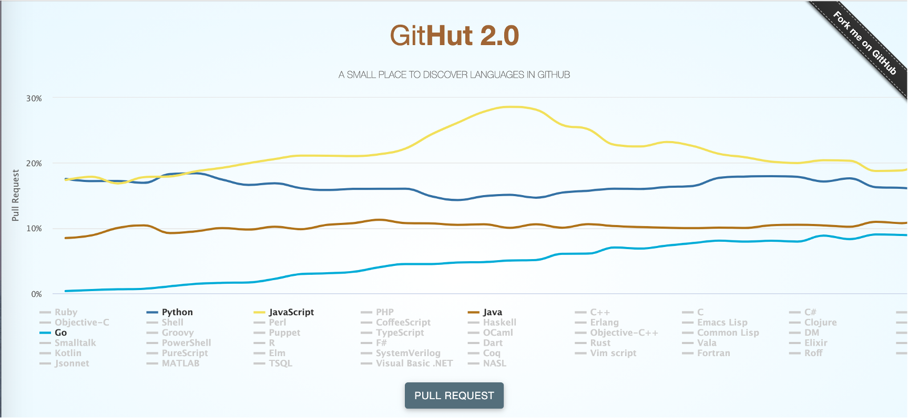
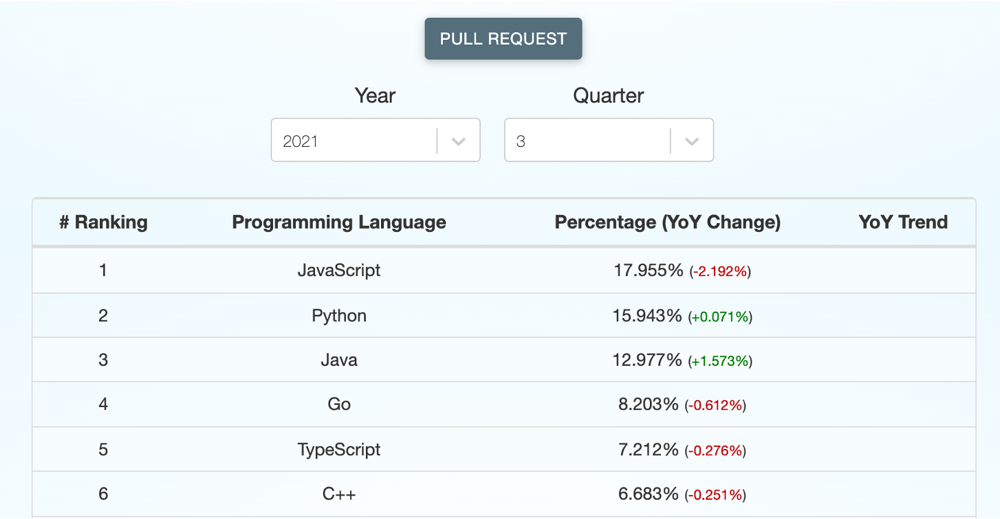
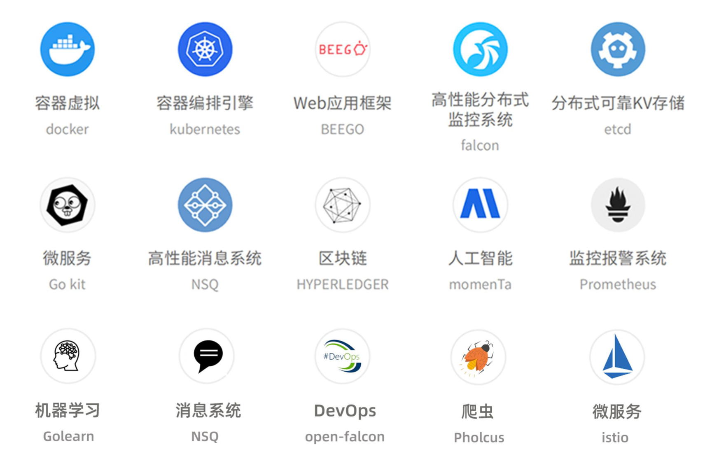
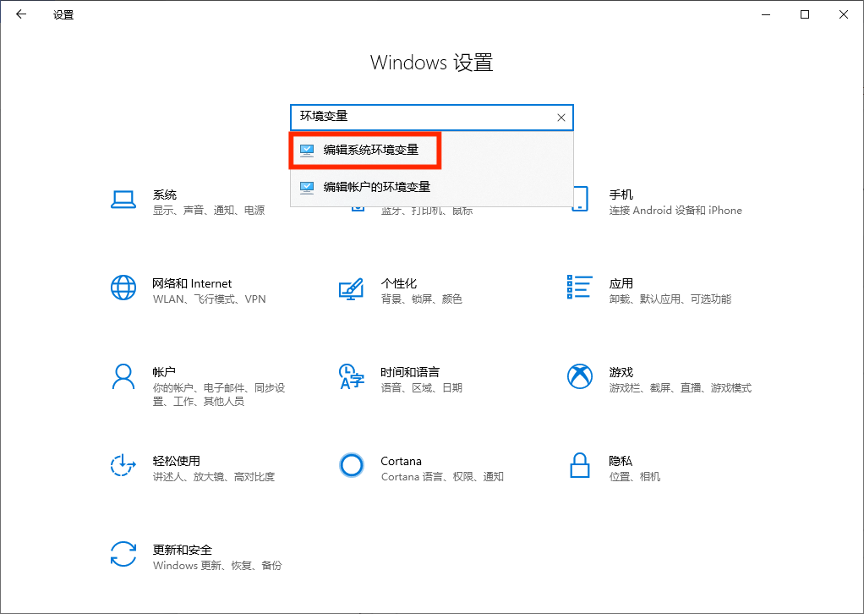
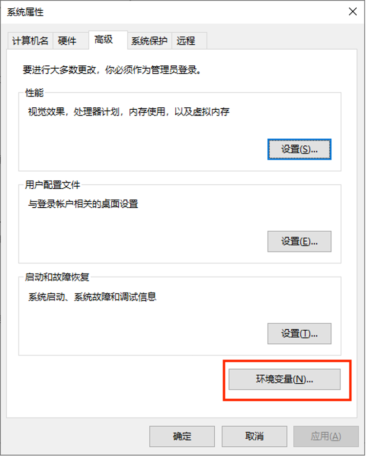
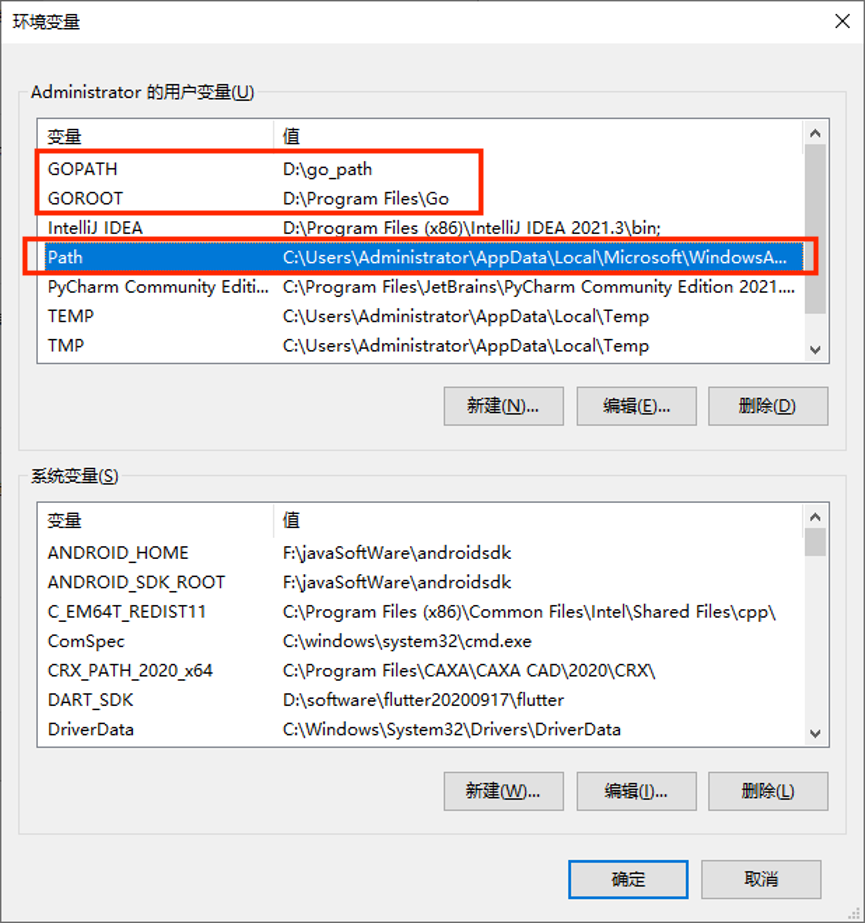
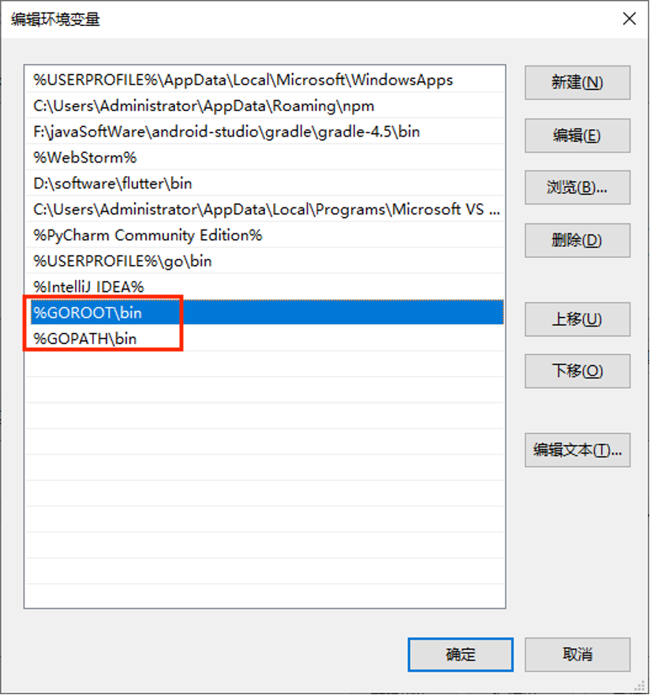
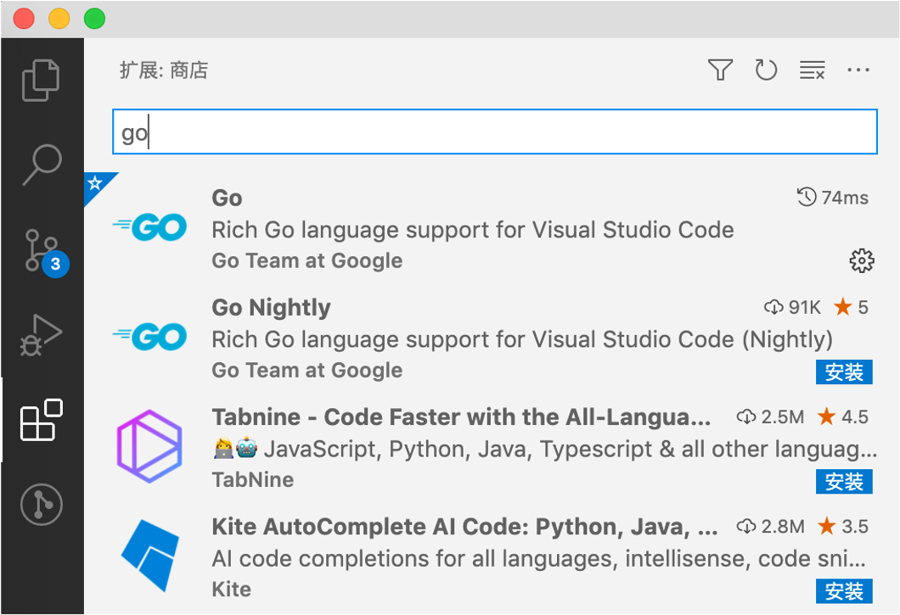

<!-- START doctoc generated TOC please keep comment here to allow auto update -->
<!-- DON'T EDIT THIS SECTION, INSTEAD RE-RUN doctoc TO UPDATE -->
**Table of Contents**  *generated with [DocToc](https://github.com/thlorenz/doctoc)*

- [初识Go语言](#%E5%88%9D%E8%AF%86go%E8%AF%AD%E8%A8%80)
  - [Go语言发展历史](#go%E8%AF%AD%E8%A8%80%E5%8F%91%E5%B1%95%E5%8E%86%E5%8F%B2)
    - [阵容豪华的创使人团队](#%E9%98%B5%E5%AE%B9%E8%B1%AA%E5%8D%8E%E7%9A%84%E5%88%9B%E4%BD%BF%E4%BA%BA%E5%9B%A2%E9%98%9F)
    - [起源](#%E8%B5%B7%E6%BA%90)
    - [发展](#%E5%8F%91%E5%B1%95)
    - [现状](#%E7%8E%B0%E7%8A%B6)
  - [Go语言的优劣](#go%E8%AF%AD%E8%A8%80%E7%9A%84%E4%BC%98%E5%8A%A3)
  - [Go语言的应用场景](#go%E8%AF%AD%E8%A8%80%E7%9A%84%E5%BA%94%E7%94%A8%E5%9C%BA%E6%99%AF)
    - [go微服务开发](#go%E5%BE%AE%E6%9C%8D%E5%8A%A1%E5%BC%80%E5%8F%91)
  - [开发环境搭建](#%E5%BC%80%E5%8F%91%E7%8E%AF%E5%A2%83%E6%90%AD%E5%BB%BA)
  - [第一个Go程序](#%E7%AC%AC%E4%B8%80%E4%B8%AAgo%E7%A8%8B%E5%BA%8F)
    - [GO开发环境](#go%E5%BC%80%E5%8F%91%E7%8E%AF%E5%A2%83)
    - [Hello World](#hello-world)
  - [Go命令介绍](#go%E5%91%BD%E4%BB%A4%E4%BB%8B%E7%BB%8D)

<!-- END doctoc generated TOC please keep comment here to allow auto update -->

# 初识Go语言
<!-- 自动生成目录的方法：doctoc 初识Go语言.md -->
## Go语言发展历史
### 阵容豪华的创使人团队
**Ken Thompson**
- 1966年：加入了贝尔实验室，在参与 Multics （多路信息计算）开发期间，创造出了B语言，并用一个月的时间用B语言开发了全新的操作系统UNICS，后来改名为我们所熟悉的UNIX 操作系统。
- 1971年：和丹尼斯·利奇（Dennis Ritchie）一起共同发明了C语言。
- 1973年：和丹尼斯·利奇（Dennis Ritchie）使用C语言重写了UNIX，并安装于PDP-11的机器之上。
- 1983年：美国计算机协会将图灵奖授予汤普森。
- 2000年：离开贝尔实验室，已退休的汤普森成为了一名飞行员。
- 2006年：加入Google工作。
- 2007年：64岁的高龄，与Rob Pike和Robert Griesemer主导了Go语言的开发。

**Rob Pike**
- Go语言项目总负责人。
- 贝尔实验室Unix团队成员，参与的项目包括Plan 9，Inferno操作系统和Limbo编程语言。
- UTF-8字符集规范唯二的发明人之一（另一位是Ken Thompson）。
- 《UNIX环境编程》和《程序设计实践》这两本书的作者之一。
- 第22届莫斯科夏季奥运会射箭项目的银牌得主。
- 业余天文学家，设计的珈玛射线望远镜差点被 NASA 用在航天飞机上。
- 他的媳妇Renee French 就是 Go 语言吉祥物的设计人。

**Robert Griesemer**
- 参与V8 JavaScript引擎的开发。
- 参与Java HotSpot虚拟机的研发。

### 起源
&#8195;&#8195;2007年，Google的几位大牛正在用C++开发一些比较繁琐但是核心的工作，主要是分布式集群，大牛觉得很闹心。此时C++委员会来他们公司做技术演讲，说C++将要添加35个新特性，大牛心里飘过一万个CNM，“C++特性还不够多吗”。于是Rob Pike说要不自己搞个简单一点的语言吧，首先名字得简单好记，大腿一拍就叫“go”。  
&#8195;&#8195;把事情搞复杂很容易，把事情搞简单才更深刻。
### 发展
- 2007年9月21日，开始雏形设计。
- 2009年10月30日，Rob Pike宣布了Go语言的存在。
- 2009年11月10日，以完全开源的方式公布了Linux和Mac OSX上的版本，11月22日公布了Windows版本。
- 2010年1月8日，当选2009年年度语言。
- 2010年5月，谷歌投入使用。
- 2011年4月，谷歌开始抽调员工全职开发Go语言，并于5月宣布Google APP Engine支持Go语言。

  

参考网站https://www.test.tiobe.com/tiobe-index/go。 

  
  

参考网站https://madnight.github.io/githut/#/pull_requests。
### 现状
&#8195;&#8195;从世界范围看，Go语言在中国的发展势头最猛，且远超第二名。在很多互联网大厂Go已成为主要开发语言。  


&#8195;&#8195;不论大小公司，对Go人才需求紧迫，薪酬很高。  


## Go语言的优劣
**优势**
- 语法简单，易于学习。类C的语法，同时比C/C++简洁和干净。
- 自带GC，方便使用。
- 快速编译，高效执行。
- 简单的依赖管理。
- 并发编程，轻松驾驭。
- 静态类型，同时有一些动态语言的特征(var声明)。
- 标准类库，规范统一。
**劣势**
- 不支持动态加载代码。
- 发展时间短，生态不及Java、C++庞大，但是够用。 
## Go语言的应用场景
### 应用场景总览
- 巨型中央服务器领域。
- 高性能分布式领域。
- 游戏服务端开发。
- 复杂事件处理。
- 对实时性要求很高的软件开发。
- 可以在Intel和ARM处理器上运行，因此也可以在安卓上运行。


### go微服务开发
- 零依赖，让我们可以最小化我们的镜像,节省存储与拉取镜像带宽。
- Runtime使用更小的内存，对比Java的JVM。
- 更好的并行能力，当你真的需求更多CPU的时候。
- 更高的性能，对比解释性语言，在处理数据已经并发方面优势明显。
- 简单，学习成本低，内部人员可以转入Go阵营。
- 使用Go能更接近云原生生态，比如docker，k8s, habor都是用Go开发的。 
## 开发环境搭建
1. 下载。到 https://studygolang.com/dl 上下载最新的Go稳定版本。
2. 安装。对于Windows和macOS用户，直接双击即可安装，留意一下安装路径。对于Linux用户，直接解压安装包即可，比如你打算把go安装到/usr/local目录下，则使用命令
tar zxvf goxxx.tar.gz –C /usr/local。这样go标准库及相关的可执行文件就安装到了/usr/local/go目录下，在后续的步骤中会把/usr/local/go赋给GOROOT环境变量。  
3. 准确GOPATH。在任意目录下创建一个空目录，将来用于存放go语言第三方库文件。比如你打算使用/data/go_path这个目录，则在Linux下使用命令mkdir -p /data/go_path。在GOPATH目录建3个子目录：src、bin、pkg。  
4. 配置环境变量。把第2步和第3步生成的目录分别赋给GOROOT和GOPATH环境变量，对于Linux和Mac用户在~/.bashrc文件中追加以下几行
```shell
export GOROOT=/usr/local/go
export GOPATH=/data/go_path
export PATH=$PATH:$GOROOT/bin: :$GOPATH/bin
```
&#8195;&#8195;PATH环境变量下的可执行文件在任意目录下都可以直接访问。  
&#8195;&#8195;对于Windows用户，编辑用户环境变量，新增GOROOT和GOPATH，把GOROOT/bin和GOPATH/bin添加到Path里。如下图    
  
 
   

  

  

&#8195;&#8195;在Windows下还可以通过go env -w来设置环境变量，比如设置GOPROXY用以下命令
```Shell
go env -w GOPROXY=https://goproxy.cn,direct 
```

&#8195;&#8195;有很多网站支持在线编辑Go代码并查看运行结果，这里列举一些  
https://play.golang.wiki  
https://play.studygolang.com  
https://goplay.space  
https://goplay.tools  
&#8195;&#8195;集成开发环境推荐GoLand和VSCode，后者是免费的。VSCode需要额外安装支持Go语言的插件，如下图  


## 第一个Go程序
```Go
package main

import (
	"fmt"
)

func main() {
	fmt.Println("Hello World")
}
```
&#8195;&#8195;main()函数是Go程序的唯一入口，且main()函数必须位于package main中。fmt是Go标准库中的一个package，该package下有一个Println()函数用于输出字符串。Go语言会依次从以下3个目录里查找依赖包：
1. 当前工作目录
2. $GOPATH/pkg/mod
3. $GOROOT/src

## Go命令介绍
```Shell
(base) zcymac:~ zcy$ go help
Go is a tool for managing Go source code.

Usage:

	go <command> [arguments]

The commands are:

	bug         start a bug report
	build       compile packages and dependencies
	clean       remove object files and cached files
	doc         show documentation for package or symbol
	env         print Go environment information
	fix         update packages to use new APIs
	fmt         gofmt (reformat) package sources
	generate    generate Go files by processing source
	get         add dependencies to current module and install them
	install     compile and install packages and dependencies
	list        list packages or modules
	mod         module maintenance
	run         compile and run Go program
	test        test packages
	tool        run specified go tool
	version     print Go version
	vet         report likely mistakes in packages

Use "go help <command>" for more information about a command.

Additional help topics:

	buildconstraint build constraints
	buildmode       build modes
	c               calling between Go and C
	cache           build and test caching
	environment     environment variables
	filetype        file types
	go.mod          the go.mod file
	gopath          GOPATH environment variable
	gopath-get      legacy GOPATH go get
	goproxy         module proxy protocol
	importpath      import path syntax
	modules         modules, module versions, and more
	module-get      module-aware go get
	module-auth     module authentication using go.sum
	packages        package lists and patterns
	private         configuration for downloading non-public code
	testflag        testing flags
	testfunc        testing functions
	vcs             controlling version control with GOVCS

Use "go help <topic>" for more information about that topic.
```
go help: 查看帮助文档。  
```Shell
go help build
```
go build: 对源代码和依赖的文件进行打包，生成可执行文件。  
```Shell
go build -o my_first_go_exe entrance_class/demo.go
```
go install: 编译并安装包或依赖，安装到$GOPATH/bin下。  
```Shell
go install entrance_class/demo.go
```
go get: 把依赖库添加到当前module中，如果本机之前从未下载过则先下载。
```Shell
go get github.com/tinylib/msgp 
```
以上命令会在$GOPATH/pkg/mod目录下会生成github.com/tinylib/msgp目录。  
```Shell
go install github.com/tinylib/msgp@latest 
```
以上命令会在$GOPATH/bin下生成msgp可执行文件。  
go mod init module_name
初始化一个Go项目。  
go mod tidy通过扫描当前项目中的所有代码来添加未被记录的依赖至go.mod文件或从go.mod文件中删除不再被使用的依赖。  
go run: 编译并运行程序。  
go test: 执行测试代码。  
go tool: 执行go自带的工具。go tool pprof对cpu、内存和协程进行监控；go tool trace跟踪协程的执行过程。  
go vet: 检查代码中的静态错误。  
go fmt: 对代码文件进行格式化，如果用了IDE这个命令就不需要了。
```Shell
go fmt entrance_class/demo.go
```
go doc: 查看go标准库或第三方库的帮助文档。 
```Shell 
go doc fmt
go doc gonum.org/v1/gonum/stat
```
go version: 查看go版本号。  
go env: 查看go环境信息。  